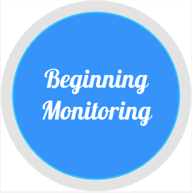

# Lucina
Group 34 Project

Known Issues:

Sound File transfer is not working
Movement Detection needs to be calibrated

Description: 

Lucina is an application that utilizes the pairing between smartphone and smartwatch to allow the user to use his/her watch as a baby monitor. When placed in a crib near the baby, the smartwatch can use its built-in sensors, namely the accelerometer and the microphone, to analyze the baby’s movements and record and transmit sounds, alerting the user when their little one is awake, cutting out the hassle and cost of buying standalone baby monitors. Furthermore, parents can see their baby’s sleeping data to better track its status over time, and compare it to the average baby’s sleeping times.

# Authors
- Marc Phillip A. Mart 
- Jian Qiao (Jack)
- Brian Pugh
- Ethan Chiou
- Sunny Singh

## Demo Video

See [Lucina Video](https://youtu.be/i7m5ZfbhArg)

## Phone Screenshots

## Watch Screenshots

# Acknowledgements
https://github.com/googlesamples/android-WclDemoSample

https://github.com/PhilJay/MPAndroidChart

